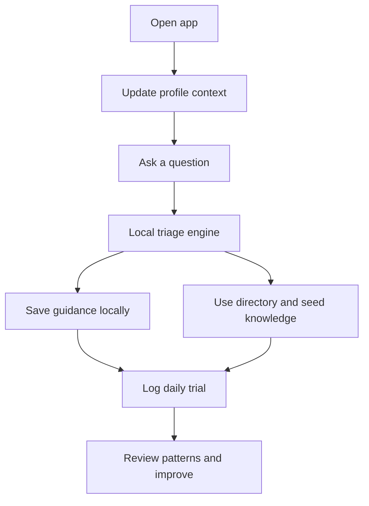
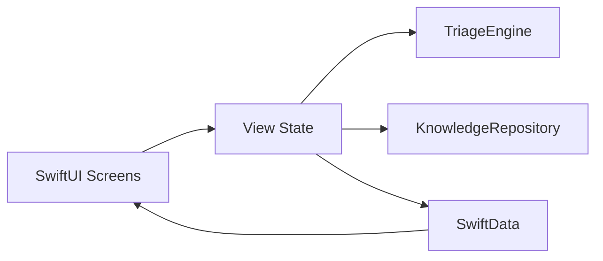
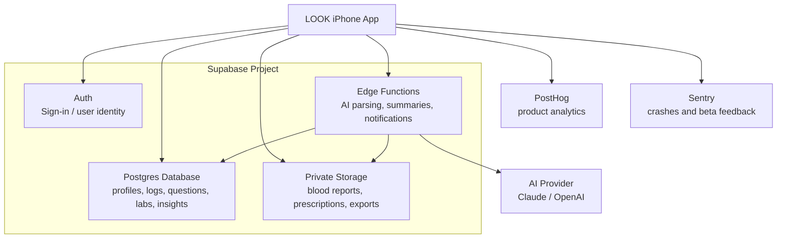

# LOOK iOS POC

This repository is now the main workspace for the LOOK iOS proof of concept.

The app is an offline-first `SwiftUI` + `SwiftData` prototype for daily personal trials. It lets you capture transplant-related questions, test a local triage flow, browse starter knowledge and directory data, and log daily friction so we can improve the product from real usage.

## Product Prototype v0.2

The product direction has been reframed as `Product Prototype v0.2`: less noisy, more generic, and more patient-centric.

Core idea:
- an AI-enabled app in the patient's hand
- helps the patient organize what happened
- helps the patient speak to the doctor with more clarity

Start here for the current product framing and visuals:
- [Product Prototype v0.2](/Users/gauravm/Documents/New%20project/docs/PRODUCT_PROTOTYPE_V0_2.md)
- [v0.2 low-fidelity wireframes](/Users/gauravm/Documents/New%20project/docs/WIREFRAMES_V0_2.md)

## What Supabase Sync Would Do

Option `2` from earlier means adding `Supabase` as the backend so the app stops being local-only.

With Supabase in place, the app could:
- back up your profile, questions, and daily trial logs across Mac and iPhone
- let us keep a shared content library and doctor directory without shipping a new app build each time
- support sign-in, cloud storage, and simple admin workflows
- become the foundation for later AI features, WhatsApp intake, and analytics

For this POC, Supabase is not required yet. Right now everything is stored on-device, which keeps iteration fast and low-risk. We should add Supabase when you want sync, backup, or remotely editable content.

## Current App Flow



## Current Architecture



## Live Architecture For Test Users

When we take LOOK live for beta users, the app should move from local-only storage to a managed backend.

Simple view:
- the `iPhone app` stays the user-facing product
- `Supabase Auth` handles sign-in
- `Supabase Postgres` stores structured user data
- `Supabase Storage` stores uploaded reports and exported PDFs
- `Supabase Edge Functions` handle secure backend logic like AI extraction and doctor summaries
- analytics and crash reporting sit alongside the product, not inside the core DB



### Where The Data Sits

| Data type | Where it lives |
|---|---|
| User profile, check-ins, meds, trials, questions | `Supabase Postgres` |
| Blood reports, prescriptions, exported PDFs | `Supabase Storage` |
| AI extraction results, normalized lab values, doctor summaries | `Supabase Postgres` |
| Secure AI/API logic | `Supabase Edge Functions` |
| Product analytics events | `PostHog` |
| Crash reports and tester feedback | `Sentry` |

### Why This Setup

- fast enough for beta without building custom infrastructure
- secure enough to keep AI keys and sensitive logic off the phone
- easy to scale from a few users to hundreds of testers
- keeps the data model clean so charts, trends, and doctor summaries are queryable later

## Run It

For iPhone setup and general Xcode launch:

```bash
cd "/Users/gauravm/Documents/New project"
./run-ios.sh
```

That script:
- regenerates `LOOKPOC.xcodeproj` from `project.yml`
- opens the Xcode project

For a Mac-focused daily flow:

```bash
cd "/Users/gauravm/Documents/New project"
./run-mac.sh
```

That script:
- regenerates `LOOKPOC.xcodeproj` from `project.yml`
- opens the Xcode project
- reminds you to choose the Mac runtime

From Xcode:
1. Choose `My Mac (Designed for iPad/iPhone)` to run on Mac.
2. Choose your connected iPhone to run on device.
3. Press `Cmd+R`.

## Daily Trial Loop

1. Capture at least one real question in `Ask`.
2. Check if the triage output feels useful.
3. Record the biggest friction in `Trials`.
4. Write one concrete improvement for tomorrow.
5. Repeat daily and review weekly.
