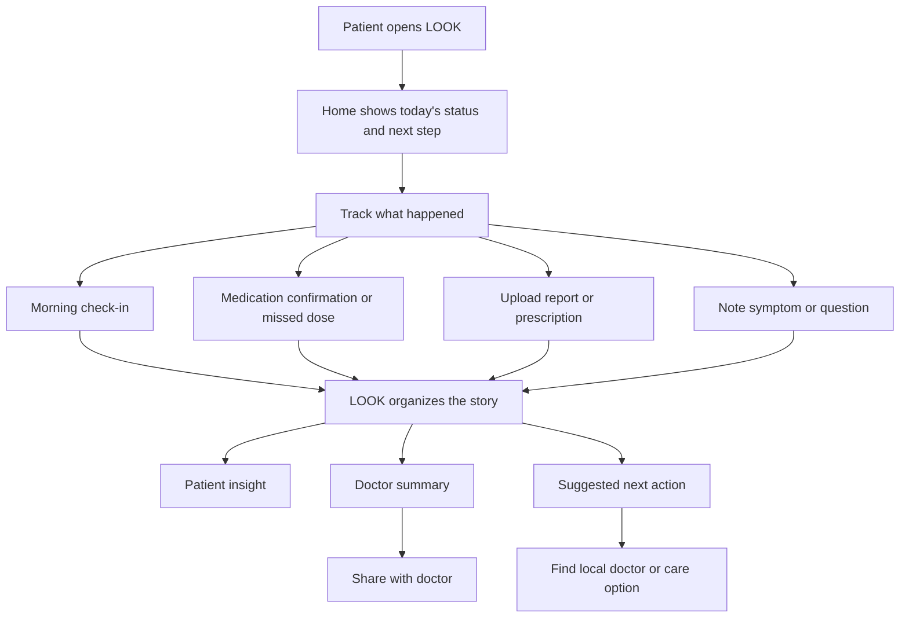
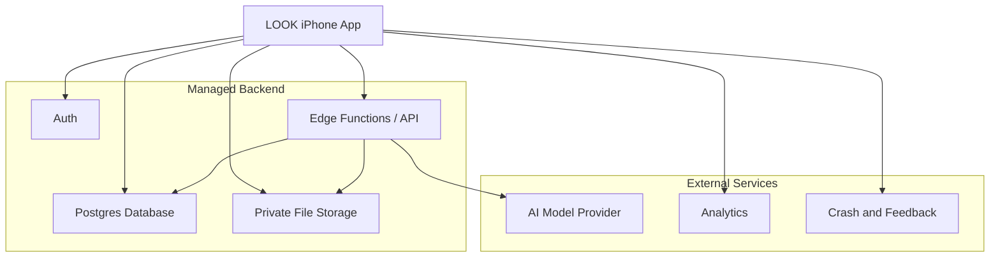

# LOOK Product Prototype v0.2

## Positioning

`LOOK v0.2` is a less noisy, more generic, patient-centric prototype.

The product is no longer framed as a transplant-only tracker with many parallel surfaces. It is framed as an `AI-enabled patient companion` that helps a person prepare for, structure, and improve conversations with their doctor.

## Vision

LOOK should become an AI-enabled app in the patient's hand that helps them notice what matters, remember what happened, organize their questions, and speak to the doctor with clarity. The product should reduce confusion before the appointment, improve communication during the appointment, and help the patient follow through after the appointment.

## Product Thesis

Patients do not just need information.

They need help answering:
- What changed?
- What should I ask?
- What should I show my doctor?
- What should I do next?

LOOK should help turn daily health noise into doctor-ready clarity.

## v0.2 Principles

1. `Patient first`
   The primary user is the patient or caregiver, not the clinician.

2. `Conversation over complexity`
   Every feature should improve the quality of the next doctor interaction.

3. `Generic core, condition-specific pathways`
   The base product should support any chronic condition, while disease modules shape the questions, insights, and prompts.

4. `Less navigation, more guidance`
   The product should feel calm and guided, not like a dashboard full of disconnected tools.

5. `AI as interpreter, not decision-maker`
   AI should summarize, organize, and explain. It should not replace clinical judgment.

## Core User Job

> Help me understand my recent health story and carry the right summary to the right doctor at the right time.

## Who v0.2 Is For

### Primary user
- patient managing a chronic condition
- caregiver helping the patient stay on track

### Initial condition pathway
- kidney transplant / CKD / dialysis

### Future pathway model
- diabetes
- oncology
- cardiac recovery
- autoimmune care

## Problems We Are Solving

1. Patients forget symptoms, questions, and medication issues before appointments.
2. Doctors receive fragmented, unstructured history.
3. Medication adherence problems are often noticed too late.
4. Uploaded reports are hard for patients to interpret.
5. Health apps often become noisy trackers instead of helpful care companions.

## v0.2 Product Shape

### Core capabilities
- daily check-in
- medication support
- question capture
- report and prescription upload
- patient insight summary
- doctor-ready summary
- local doctor discovery

### What changes from v0.1 thinking
- fewer surfaces
- more guided flows
- less emphasis on separate "analytics" as a standalone area
- stronger emphasis on "prepare me for my doctor"
- disease-agnostic product shell with condition modules

## Recommended Information Architecture

### Proposed simplified navigation

1. `Home`
   Daily status, next actions, safety prompts, latest insight

2. `Track`
   Check-ins, medication logging, symptoms, uploads

3. `Doctors`
   Questions, doctor summary, local doctor discovery

4. `Profile`
   Profile, condition pathway, caregiver, settings

### Notes
- `Insights` should mostly fold into `Home`
- `Ask` should merge into `Doctors`
- `Trials` should merge into `Track`
- the app should feel like one continuous care workflow

## Experience Diagram

## Simple Product Box Diagram

```mermaid
flowchart LR
    APP["LOOK App"]

    subgraph CORE["Core Patient Experience"]
        HOME["Home"]
        TRACK["Track"]
        DOCS["Doctors"]
        PROFILE["Profile"]
    end

    subgraph INTELLIGENCE["AI and Insight Layer"]
        ORG["Organize history"]
        SUM["Summarize for patient"]
        DOCSUM["Summarize for doctor"]
        ALERT["Flag missed meds or concerning patterns"]
    end

    subgraph DATA["User Data"]
        CHECKINS["Check-ins"]
        MEDS["Medication logs"]
        REPORTS["Reports and prescriptions"]
        QUESTIONS["Questions and notes"]
        DIRECTORY["Local doctor directory"]
    end

    APP --> CORE
    CORE --> INTELLIGENCE
    CORE --> DATA
    DATA --> INTELLIGENCE
```

## Live Architecture v0.2

## Feature Set For v0.2

| Area | v0.2 role |
|---|---|
| Home | show today's state, safety, latest insight, next action |
| Track | capture meds, check-ins, symptoms, reports |
| Doctors | organize questions, summaries, and local discovery |
| Profile | define user context, condition pathway, caregiver settings |
| AI layer | extract, summarize, and prepare conversation material |

## What v0.2 Should Explicitly Not Try To Be

- not a replacement for a doctor
- not a hospital EMR
- not a generic wellness tracker
- not a crowded feature box
- not a disease-everything platform on day one

## Product Language To Use

### Short description
LOOK is an AI-enabled patient companion that helps people track what matters, prepare for appointments, and speak to doctors with more clarity.

### One-line promise
`From daily health noise to doctor-ready clarity.`

## Immediate Design Direction

### Keep
- medication adherence support
- document upload
- doctor summary
- question capture
- local doctor directory

### Simplify
- tab count
- duplicate logging surfaces
- standalone analytics feeling

### Strengthen
- missed-medication alerts
- patient-to-doctor handoff
- local doctor connection
- condition-specific modules on top of a generic care core

## Prototype Scope Recommendation

### Prototype v0.2
- patient login only
- no separate doctor login yet
- one strong patient workflow
- one clear doctor handoff
- one clear safety posture

### Later
- doctor portal
- caregiver escalation
- multi-condition modules
- backend-powered AI extraction and summaries

## Success Criteria

v0.2 is working if a patient can:

1. log what happened in less than 2 minutes
2. see what matters today
3. prepare a better doctor conversation
4. share a usable summary
5. feel less lost after the appointment
