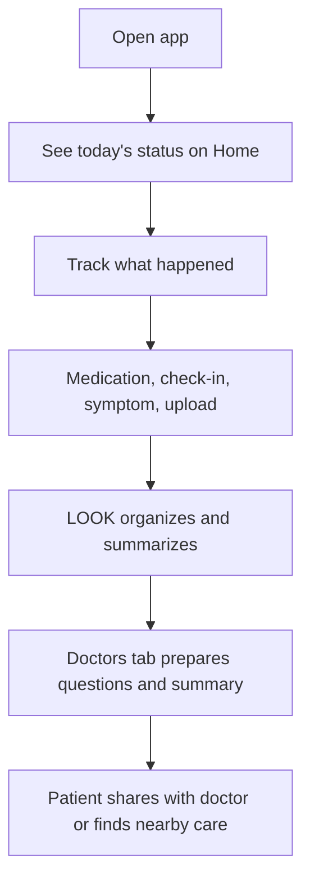

# LOOK v0.2 Low-Fidelity Wireframes

## Purpose

This document translates `Product Prototype v0.2` into a simple screen-by-screen blueprint.

The goal is not high-fidelity UI design.

The goal is to define:
- the reduced navigation
- the patient-first flow
- the key actions on each screen
- what should be visible before we add visual polish

## Product Frame

LOOK v0.2 is an AI-enabled patient companion that helps people:
- track what matters
- prepare for appointments
- speak to doctors with more clarity

## Navigation Model

### Bottom tabs

1. `Home`
2. `Track`
3. `Doctors`
4. `Profile`

### Why this is simpler

- `Insights` is folded into `Home`
- `Ask` is folded into `Doctors`
- `Trials` is folded into `Track`
- the patient sees one connected workflow instead of multiple parallel tools

## Primary User Flow



## Screen 1: Home

### Role

The Home screen should answer:
- What matters today?
- What should I do next?
- Is anything concerning?
- What should I take to my doctor?

### Layout

```text
+--------------------------------------------------+
| LOOK                               alert dot     |
+--------------------------------------------------+
| Good morning, Gaurav                              |
| Day 24 of your care journey                       |
| Today: 1 medication due · 1 question open         |
+--------------------------------------------------+
| TODAY'S STATUS                                    |
| [ Medication due at 8 PM ]                        |
| [ Last check-in: Unsure ]                         |
| [ Latest lab: Creatinine stable ]                 |
+--------------------------------------------------+
| NEXT BEST ACTION                                  |
| "Confirm your evening medication"                 |
| [ Confirm ]   [ Track symptoms ]                  |
+--------------------------------------------------+
| PATIENT INSIGHT                                   |
| "The last 7 days look stable overall, but you     |
| missed one evening dose and noted fatigue twice." |
+--------------------------------------------------+
| DOCTOR READY                                      |
| "2 questions saved · summary ready"               |
| [ View doctor summary ]                           |
+--------------------------------------------------+
| QUICK ACTIONS                                     |
| [ Upload report ] [ Add question ] [ Find doctor ]|
+--------------------------------------------------+
| Home | Track | Doctors | Profile                  |
+--------------------------------------------------+
```

### Key components

- greeting and context
- today's status block
- next best action
- patient insight summary
- doctor-ready handoff
- quick actions

### Design intent

- calm
- guided
- very little visual clutter
- one strong action priority

## Screen 2: Track

### Role

The Track screen should help the patient quickly log what happened without feeling like they are filling a long medical form.

### Layout

```text
+--------------------------------------------------+
| LOOK                              Track           |
+--------------------------------------------------+
| TRACK TODAY                                       |
| [ Morning check-in ] [ Medication ] [ Symptoms ]  |
| [ Upload report ]                                 |
+--------------------------------------------------+
| MORNING CHECK-IN                                  |
| How are you today?                                |
| [ All good ] [ Unsure ] [ Need help ]             |
+--------------------------------------------------+
| MEDICATION                                        |
| Tacrolimus due at 8 PM                            |
| [ Confirm taken ]                                 |
| If missed: [ I missed this dose ]                 |
+--------------------------------------------------+
| SYMPTOMS / NOTES                                  |
| What changed today?                               |
| [ text input area ]                               |
+--------------------------------------------------+
| DOCUMENTS                                         |
| [ Upload blood report ] [ Upload prescription ]   |
+--------------------------------------------------+
| SAVE TODAY                                        |
| [ Save today's update ]                           |
+--------------------------------------------------+
| Home | Track | Doctors | Profile                  |
+--------------------------------------------------+
```

### Key components

- morning check-in
- medication confirmation or missed-dose logging
- simple symptom/note capture
- report and prescription upload
- single save action

### Design intent

- one place for daily capture
- no separate "Trials" mental model
- faster than the current prototype

## Screen 3: Doctors

### Role

The Doctors screen should help the patient prepare for a medical conversation and connect to care nearby.

### Layout

```text
+--------------------------------------------------+
| LOOK                              Doctors         |
+--------------------------------------------------+
| PREPARE FOR YOUR DOCTOR                           |
| "We organized your recent history into a summary" |
| [ View summary ] [ Share PDF ]                    |
+--------------------------------------------------+
| QUESTIONS TO ASK                                  |
| 1. Is my tacrolimus timing okay?                  |
| 2. Is fatigue expected this week?                 |
| [ Add question ]                                  |
+--------------------------------------------------+
| RECENT HEALTH STORY                               |
| - 1 missed medication in last 7 days              |
| - 2 unsure check-ins                              |
| - Creatinine stable                               |
+--------------------------------------------------+
| FIND A DOCTOR                                     |
| City: Bengaluru                                   |
| [ Nephrology ] [ Transplant ] [ General ]         |
|--------------------------------------------------|
| Dr. A Name              Hospital name             |
| 4 km away               [ View / Call ]           |
|--------------------------------------------------|
| Dr. B Name              Hospital name             |
| 7 km away               [ View / Call ]           |
+--------------------------------------------------+
| Home | Track | Doctors | Profile                  |
+--------------------------------------------------+
```

### Key components

- doctor-ready summary
- question organizer
- recent health story
- local doctor discovery

### Design intent

- make the patient feel prepared
- improve appointment quality
- connect insight to action

## Screen 4: Profile

### Role

The Profile screen defines user context so the app can be relevant without feeling overly clinical.

### Layout

```text
+--------------------------------------------------+
| LOOK                              Profile         |
+--------------------------------------------------+
| YOU                                               |
| Name: Gaurav                                      |
| City: Bengaluru                                   |
| Language: English                                 |
+--------------------------------------------------+
| CARE PATHWAY                                      |
| Condition: Kidney transplant                      |
| Stage: Post-transplant                            |
| [ Change pathway ]                                |
+--------------------------------------------------+
| CAREGIVER                                         |
| Name: Family member                               |
| Phone / WhatsApp                                  |
| [ Update caregiver ]                              |
+--------------------------------------------------+
| ALERTS AND REMINDERS                              |
| [ ] Missed medication reminders                   |
| [ ] Caregiver alerts                              |
| [ ] Appointment nudges                            |
+--------------------------------------------------+
| DATA AND PRIVACY                                  |
| Documents uploaded: 4                             |
| Sync status: Local only / Cloud connected         |
| [ Export my data ]                                |
+--------------------------------------------------+
| Home | Track | Doctors | Profile                  |
+--------------------------------------------------+
```

### Key components

- patient identity and context
- care pathway
- caregiver
- notification preferences
- data and privacy controls

## Secondary Flows

## A. Upload flow

```text
Track -> Upload report / Upload prescription
      -> choose camera / photo / file
      -> AI extracts key information
      -> patient sees plain-language summary
      -> save to record
      -> surface new summary on Home and Doctors
```

## B. Missed medication flow

```text
Medication due
-> patient does not confirm
-> gentle reminder
-> mark as missed if no response
-> show on Home
-> include in Doctor summary
-> optionally notify caregiver later
```

## C. Doctor prep flow

```text
Patient adds questions
-> LOOK combines logs, meds, and uploads
-> doctor summary generated
-> patient shares PDF or speaks from summary screen
```

## Data Visibility By Screen

| Data | Home | Track | Doctors | Profile |
|---|---|---|---|---|
| daily status | yes | yes | light summary | no |
| medication state | yes | yes | yes | preferences only |
| check-ins | summary | yes | summary | no |
| documents | latest result | upload/manage | summary for doctor | count/privacy |
| questions | count | optional quick add | yes | no |
| local doctors | quick shortcut | no | yes | city context only |

## What To Remove From The Current Prototype

- separate `Insights` tab
- separate `Ask` tab
- separate `Trials` mental model
- overly analytical chart-first feeling on primary navigation
- duplicate entry points for the same action

## What To Preserve From The Current Prototype

- medication adherence support
- morning check-in
- report upload
- question capture
- doctor summary concept
- local doctor directory
- strong safety language

## Prototype Build Order

1. simplify navigation to 4 tabs
2. merge daily capture into `Track`
3. move doctor prep into `Doctors`
4. fold insights into `Home`
5. keep `Profile` for pathway, caregiver, and settings

## Decision Standard

When deciding whether a component belongs in v0.2, ask:

> Does this help the patient understand their recent health story and speak to the doctor better?

If not, it probably does not belong in the primary experience.
