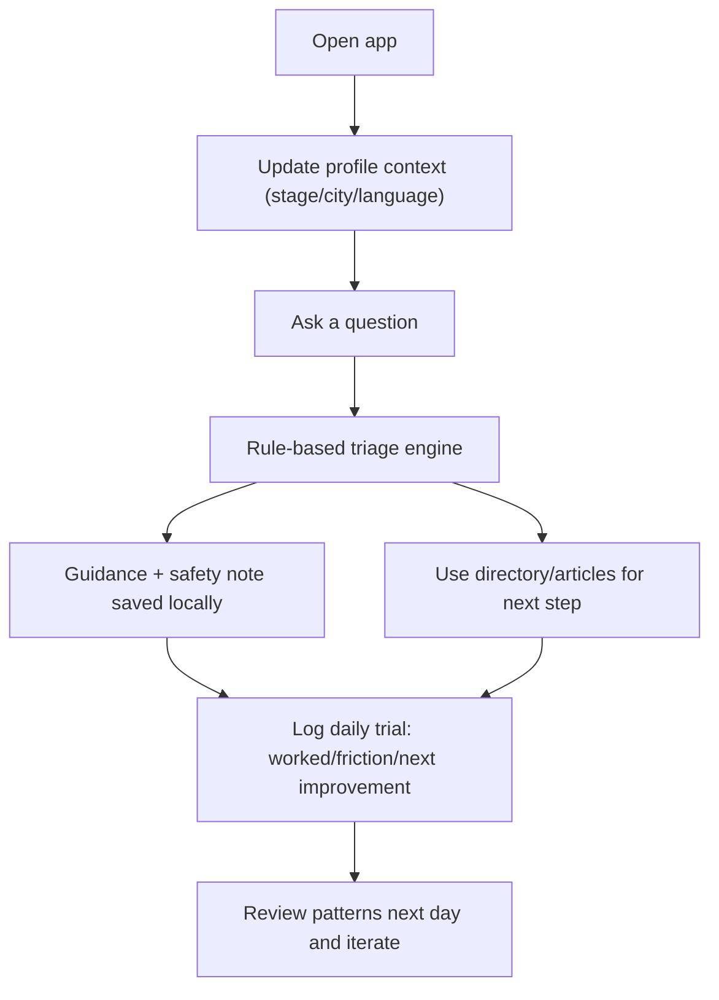
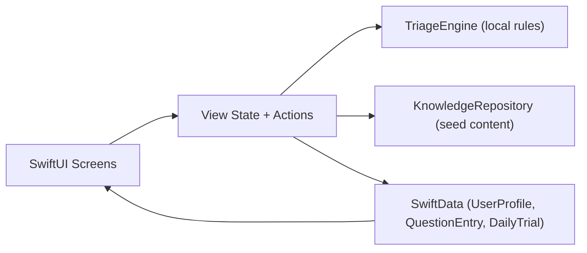

# LOOK iOS POC

This is an offline-first iOS POC for daily personal trials of the LOOK platform.

## What is built
- `SwiftUI` iOS app with `SwiftData` local persistence
- Profile setup: stage, city, language
- Ask flow with rule-based triage and safety messaging
- Local knowledge + doctor/community directory seed data
- Daily trial logger to capture friction and improvements

## User Flow

## POC Architecture

## Run on Mac + iPhone
1. Generate the Xcode project:
   - `cd /Users/gauravm/Documents/New project/look-ios-poc`
   - `xcodegen generate`
2. Open project:
   - `open LOOKPOC.xcodeproj`
3. In Xcode:
   - Select target `LOOKPOC`
   - Set your unique bundle id (Signing & Capabilities)
   - Select your Apple Team
4. Connect iPhone and trust the Mac
5. Select your iPhone as run destination and press Run

## Daily Trial Loop (recommended)
1. Capture at least one real question in `Ask`.
2. Check if triage category and recommendation feel correct.
3. Record one friction in `Trials`.
4. Add one concrete improvement in `Trials`.
5. Review last 7 logs every Sunday and prioritize the top repeated friction.

## Suggested next technical steps
1. Add Supabase sync for backup across devices.
2. Replace local triage with backend policy + Claude API.
3. Add WhatsApp webhook intake for the same question pipeline.
